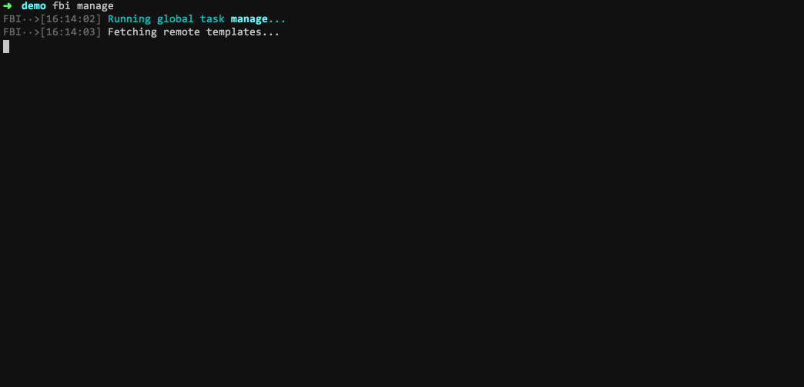

# fbi-task-manage

Manage fbi templates and tasks, add/update/remove.

> This is a fbi task. If you haven't installed [fbi](https://github.com/AlloyTeam/fbi) yet, use the following command to install.
>
> `$ npm i -g fbi` or `yarn global add fbi`



## Requirements

- `fbi v3.0+`
- `node v7.6+`

## Features

- list templates and tasks (including personal templates and tasks)
- add remote's template
- remove local templates
- update local templates

## Usage

**Install**

```bash
$ fbi add https://github.com/fbi-templates/fbi-task-manage.git
```

**Run**

```bash
$ fbi manage
```

## More

- [Official templates](https://github.com/fbi-templates)
- [`fbi` documentation](https://neikvon.gitbooks.io/fbi/content/)

## License

[MIT](https://opensource.org/licenses/MIT)

## [Changelog](https://github.com/fbi-templates/fbi-task-manage/blob/master/CHANGELOG.md)
